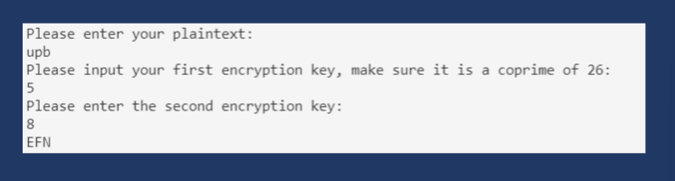
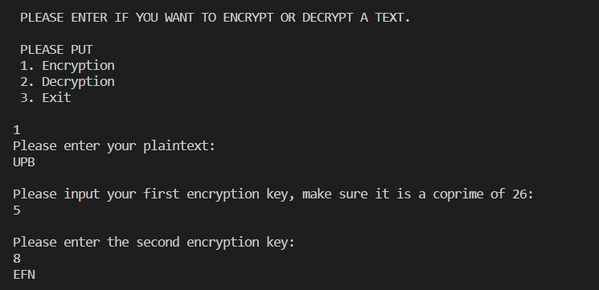

# PERTEMUAN 7
### NAMA: DIYAN ARUM MAHESWARI 
### KELAS: TI. 20. A. 1
### NIM: 312010133

_____________________________________________________________________

### Mencoba membuat hasil output Affine Cipher seperti gambar dibawah

Berikut hasil dari Encryption seperti diatas yang sudah saya lakukan.

    

Berikut hasil dari Decryption seperti diatas yang sudah saya lakukan.

# 
 THANK'S FOR YOUR ATTENTION!! SEE YOU!!